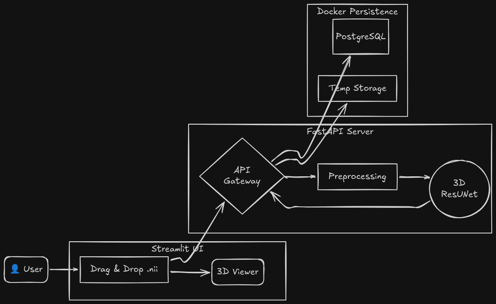

# 🏥 3D Liver & Tumor Segmentation Pipeline

[](https://www.python.org/downloads/)
[](https://fastapi.tiangolo.com/)
[](https://pytorch.org/)
[](https://monai.io/)
[](https://www.docker.com/)

> **A full-stack, hardware-agnostic medical AI system capable of segmenting Liver and Tumor volumes from 3D CT scans on consumer-grade hardware (8GB RAM).**


---

## 🎯 Project Purpose: Bridging the "Hardware Gap"
Manual segmentation of liver tumors is a slow, subjective process often relying on rough estimates. While state-of-the-art AI models exist, they typically require **data center GPUs with 24GB+ VRAM** to process high-resolution 3D medical volumes.

**This project solves two critical problems:**
1.  **Clinical Objectivity:** Provides automated, precise volumetrics ($cm^3$) and **Tumor Burden Percentage** for surgical planning.
2.  **Accessibility:** Engineered a **Resource-Optimized Pipeline** that runs heavy 3D Deep Learning models on standard laptops (8GB RAM), democratizing access to advanced medical AI.

---

## 🏗️ System Architecture


---

## 🧠 The Brain: 3D ResUNet & MONAI
I chose a **3D ResUNet** architecture over standard 2D models because medical diagnosis requires **volumetric context**. A tumor's shape is defined by the slices above and below it, not just the current pixel.


### Why MONAI?
I leveraged the **Medical Open Network for AI (MONAI)** to handle professional-grade 3D data processing:
* **Sliding Window Inference:** To prevent OOM (Out of Memory) errors on 110MB+ NIfTI files, the model processes scans in overlapping chunks (e.g., $96^3$) and stitches them with Gaussian blending.
* **Isotropic Resampling (`Spacingd`):** Normalizes all incoming scans to a consistent voxel spacing ($1.5 \times 1.5 \times 2.0mm$), ensuring the AI sees physical distance rather than just pixel distance.

---

## 🛠️ Tech Stack

| Component | Technology | Role in Architecture |
| :--- | :--- | :--- |
| **Backend** | **FastAPI** | High-performance async API managing inference queues and memory. |
| **AI Engine** | **PyTorch / MONAI** | 3D ResUNet implementation and sliding window inference logic. |
| **Database** | **PostgreSQL** | Running via **Docker Compose** for portable, isolated persistence. |
| **Frontend** | **Streamlit** | Interactive dashboard for uploading NIfTI files and 3D visualization. |
| **Processing**| **NiBabel / SciPy** | NIfTI file handling, orientation correction, and array manipulation. |

---

## 🧪 Engineering Challenges & Solutions
Building this as a student meant solving "real world" data problems that don't exist in clean datasets.

### 1. The "Pancake" Effect (Anisotropy)
**Problem:** CT voxels are often tall ($5mm$) but narrow ($0.7mm$). When viewing them from the side (Sagittal), the patient looks squashed flat.
* **Solution:** Developed a custom **Aspect Ratio Correction** module in the frontend. It reads the NIfTI header and dynamically stretches the image using `scipy.ndimage.zoom` during visualization to restore anatomical proportions.

### 2. Orientation Chaos (RAS Normalization)
**Problem:** Medical scans can be saved in any orientation (Left-to-Right, Posterior-to-Anterior, etc.).
* **Solution:** Implemented an automated **RAS (Right, Anterior, Superior)** normalizer using `nibabel.as_closest_canonical()`. This ensures every scan is "upright" before the AI touches it.

### 3. The 8GB RAM Constraint
**Problem:** Loading a full 3D volume + Model Weights + Inference overhead instantly killed the process.
* **Solution:** Implemented aggressive **Garbage Collection (`gc.collect`)** and memory mapping strategies to clear RAM immediately after every inference cycle, keeping the server stable.

---

## 📊 Results
The pipeline was evaluated on diverse validation sets.

* **Mean Dice Score (Liver):** **0.88**
* **Inference Speed:** ~5-10s per volume (CPU/Low-VRAM GPU)
* **Output Metrics:** Total Liver Volume, Tumor Volume, Tumor Burden %.

---

## 🚀 Getting Started

### 1. Clone & Setup

```bash
git clone [https://github.com/Musstavo/Liver-Tumor-Segmentation.git](https://github.com/Musstavo/Liver-Tumor-Segmentation.git)
cd Liver-Tumor-Segmentation

# Create Virtual Environment
python -m venv .venv
source .venv/bin/activate  # Windows: .venv\Scripts\activate

# Install Dependencies
pip install -r requirements.txt
```

### 2. Database (Docker)

Ensure Docker Desktop is running, then spin up the PostgreSQL container:
```bash
docker-compose up -d
```

### 3. Run the Pipeline

Open two terminal windows:

Terminal 1 (Backend):
```bash
uvicorn src.api.main:app --host 0.0.0.0 --port 8000
```
Terminal 2 (Frontend):
```bash
streamlit run src/app.py
```

### 4. Usage (After running both FastAPI and Streamlit servers locally)
Go to http://localhost:8501, upload a .nii file, and click "Run Analysis".

---

## 📂 Project Structure
```text
.
├── models/
│   └── liver_unet.pth      # Pre-trained 3D ResUNet weights
├── src/
│   ├── api/
│   │   └── main.py         # FastAPI backend entry point
│   ├── core/
│   │   ├── arch.py         # 3D ResUNet architecture definition
│   │   ├── predict.py      # Inference logic (Sliding Window)
│   │   └── transforms.py   # MONAI preprocessing pipelines
│   ├── database/
│   │   ├── db.py           # Database connection configuration
│   │   ├── models.py       # SQLModel schemas
│   │   └── crud.py         # Database query operations
│   └── web/
│       └── app.py          # Streamlit Interactive Dashboard
├── docker-compose.yml      # PostgreSQL & PgAdmin configuration
└── requirements.txt        # Python dependencies
```
---

🤝 Acknowledgments
Dataset: [Liver Tumor Segmentation Dataset](https://www.kaggle.com/datasets/andrewmvd/liver-tumor-segmentation/data)
